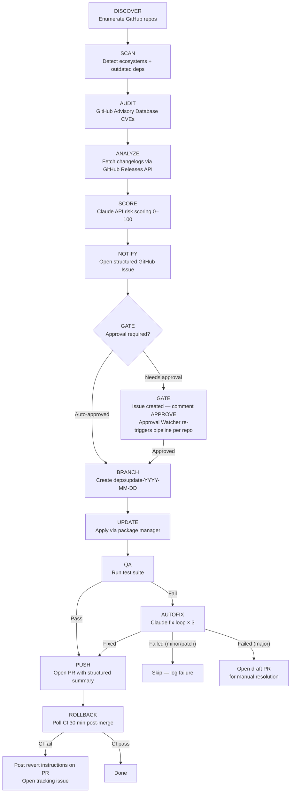

# Dep Bot — Automated Dependency Management

> An automated, AI-powered dependency management system that scans personal GitHub
> repositories on a schedule, analyzes available updates using Claude, scores them
> for risk, notifies the owner, and — upon approval — applies changes, runs QA,
> auto-fixes regressions, and opens a pull request. Built as a portfolio-grade project
> demonstrating senior-level software engineering, Claude API integration, and system design.

---

## Pipeline Overview



---

## Setup & Installation

### Prerequisites

- Node.js ≥ 20.0.0
- A GitHub account with a personal access token (or use GitHub Actions `GITHUB_TOKEN`)
- An Anthropic API key

### Steps

1. **Clone the repository**
   ```bash
   git clone https://github.com/YOUR_USERNAME/project-dependency-workflow.git
   cd project-dependency-workflow
   ```

2. **Install dependencies**
   ```bash
   npm install
   ```

3. **Configure the bot**
   ```bash
   cp bot.config.example.json bot.config.json
   ```
   Then edit `bot.config.json` and set at minimum:
   ```json
   {
     "github_username": "your-github-username"
   }
   ```

4. **Set environment variables** (for local runs)
   ```bash
   export GITHUB_TOKEN=ghp_...
   export ANTHROPIC_API_KEY=sk-ant-...
   ```

5. **Run in dry-run mode** to verify setup
   ```bash
   DRY_RUN=true node src/index.js
   ```

6. **Deploy to GitHub Actions**
   Push the repository to GitHub. Four workflows will be active:
   - `.github/workflows/deps-bot.yml` — full pipeline scan, triggers on Mondays at 08:00 UTC (or manually)
   - `.github/workflows/approve-watcher.yml` — polls every 30 minutes for approved issues and creates PRs automatically
   - `.github/workflows/bulk-approve.yml` — approves all open dep-bot issues in one shot and immediately triggers the watcher
   - `.github/workflows/bulk-merge.yml` — squash-merges all open dep-bot PRs whose CI checks have passed

   Add the required secrets in your repository settings.

---

## Environment Variables

| Variable | Required | Description |
|---|---|---|
| `GITHUB_TOKEN` | Yes | GitHub PAT or Actions token. Needs `repo`, `issues`, and `pull-requests` write. |
| `ANTHROPIC_API_KEY` | Yes | Anthropic API key for Claude analysis. |
| `DISCORD_WEBHOOK` | No | Full Discord webhook URL for push notifications. Takes precedence over `notification_webhook` in config. |
| `NTFY_TOPIC` | No | ntfy.sh topic name for push notifications. |
| `TARGET_REPO` | No | Limit run to a single repository by name or full name (e.g. `my-repo` or `username/my-repo`). |
| `DRY_RUN` | No | Set to `"true"` to run without making any changes. Overrides `bot.config.json`. |
| `NOTIFY_USERNAME` | No | GitHub username to @-mention in issue notifications. Falls back to `github_username` in `bot.config.json`. |
| `PAT_EXPIRY_DATE` | No | Expiry date of the `GH_PAT` token (e.g. `2026-06-29`). When set, the bot sends a Discord/ntfy warning 14 days before expiry. Update alongside `GH_PAT` each time a new token is created. |
| `LOG_LEVEL` | No | Pino log level. Defaults to `"info"`. |

---

## Configuration Reference (`bot.config.json`)

| Key | Type | Default | Description |
|---|---|---|---|
| `schedule` | string | `"0 8 * * 1"` | Cron schedule for the GitHub Actions workflow. |
| `github_username` | string | `""` | Your GitHub username. Used to scope repository discovery. |
| `excluded_repos` | string[] | `[]` | Repository names to skip entirely. |
| `priority_repos` | string[] | `[]` | Repositories to process first in each run. |
| `notification_webhook` | string | `""` | Discord webhook URL fallback (overridden by `DISCORD_WEBHOOK` env var). |
| `max_autofix_attempts` | number | `3` | Maximum Claude-powered autofix iterations per test failure. |
| `auto_approve_patch` | boolean | `true` | Auto-approve patch updates below the risk threshold. |
| `auto_approve_minor` | boolean | `true` | Auto-approve minor updates below the risk threshold. |
| `auto_approve_major` | boolean | `false` | Auto-approve major updates (not recommended). |
| `risk_threshold_auto_approve` | number | `50` | Risk scores above this always require manual approval via the gate. |
| `dry_run` | boolean | `false` | Run the full pipeline without applying any changes. |
| `cache_ttl_hours` | number | `24` | How long changelog analysis results are cached. |
| `scan_ecosystems` | string[] \| null | `null` | Limit ecosystem detection to specific ecosystems (e.g. `["node"]`). `null` checks all supported ecosystems. |
| `repo_concurrency` | number | `3` | Number of repositories to process in parallel. Increase for large portfolios; decrease if hitting GitHub rate limits. |
| `held_packages` | object | `{}` | Package-level version holds. Map of package name → semver range. Packages whose latest version falls outside the range are silently skipped until the hold is lifted. E.g. `{ "typescript": "< 6" }` holds TypeScript below v6. |

---

## Dashboard

The project includes a read-only SPA dashboard that visualises the most recent pipeline run.

```bash
# Development server (live reload)
npm run dashboard:dev

# Production build → dist/
npm run dashboard:build

# Preview the production build
npm run dashboard:preview
```

After a pipeline run, `.cache/run-report.json` is written automatically. The dashboard
reads this file to display repository status, risk scores, advisory badges, and PR links.
The dashboard uses static fixture data when no run report is present, so it works
immediately after cloning without needing a live GitHub token.

---

## Design Decisions

### Why Claude API for analysis (vs. static semver heuristics)?

Static heuristics (e.g., "major bump = high risk") miss the most important signal:
*what actually changed*. A major version bump in a small utility may be trivial;
a patch release for a crypto library may be critical. Claude can read a changelog,
identify breaking changes, assess the blast radius in plain English, and produce
a structured JSON risk score — something no regex or semver rule can replicate.
The cost is a few cents per analysis run, and results are cached to avoid repeat calls.

### Why GitHub Advisory Database (vs. Snyk/Dependabot)?

The GitHub Advisory Database is free, open, and queryable via GraphQL without
rate-limit concerns for personal use. Snyk requires paid tiers for private repos
at scale, and Dependabot is a black box — this project intentionally builds a
transparent, inspectable alternative that shows its reasoning at every step.

### Why file-based cache (vs. Redis/DB)?

This bot runs as a transient GitHub Actions job. A Redis instance would require
always-on infrastructure, adding cost and operational overhead that exceeds the
value for a single-user tool. A JSON file in `.cache/` (gitignored) is
zero-infrastructure, immediately inspectable with any editor, and sufficient for
the access patterns here (keyed reads/writes, per-package granularity, 24hr TTL).

### The approval gate UX rationale

The gate is designed around the cognitive model of "interrupt only when necessary."
Patch updates are invisible — they just happen. Minor updates run overnight and
appear as a PR the next morning. Only major bumps (or anything Claude flags as
high-risk) interrupt the owner's workflow with an issue that requires a response.
This mirrors how experienced engineers mentally categorise dependency updates,
making the bot feel like a smart assistant rather than a noisy alarm system.

The intended flow is: **comment `APPROVE` on the issue → a PR appears automatically
within ~30 minutes**, handled by the Approval Watcher workflow. GitHub Actions jobs
cannot block indefinitely waiting for human input, so the watcher runs on a separate
30-minute schedule to bridge that gap — no manual re-trigger required.

To opt out of a specific repo before approving, comment `SKIP` on its issue. The
watcher and the Bulk Approve workflow both honor `SKIP` — an issue with a `SKIP`
comment is never processed, even if it also has an `APPROVE` comment.

For weeks with many open issues, the **Bulk Approve** workflow (`Actions → Bulk Approve
→ Run workflow`) comments `APPROVE` on every open dep-bot issue that does not have a
`SKIP` comment, then immediately triggers the Approval Watcher so PRs are created
without waiting for its next 30-minute tick. Once the watcher finishes (~2–3 min) and
CI passes on each PR, run the **Bulk Merge** workflow (`Actions → Bulk Merge → Run workflow`)
to squash-merge everything in one shot. PRs that are still running CI or have conflicts
are skipped and reported — re-run Bulk Merge once they resolve.

### Why vanilla JS for the dashboard (vs. React/Vue)?

The dashboard is intentionally framework-free. It is a read-only display layer
over a single JSON file — adding a build-time framework would introduce more
complexity than the problem warrants. Vanilla JS keeps the bundle tiny, the
dependency surface minimal, and demonstrates that component architecture and
clean separation of concerns do not require a framework to achieve.

---

## Known Limitations

- **No private repo changelog access**: The GitHub Releases API only returns
  changelog data for public repositories. Private dependency changelogs fall back
  to Claude analysing version numbers alone, which reduces analysis quality.
- **Node.js updates only in the automated branch/PR flow**: Scanner and auditor
  support Node.js, Python, Rust, Go, and Ruby. However, `updater.js` currently
  applies updates via `npm install` only. Non-Node ecosystems are scanned,
  analysed, and reported, but the branch/update/QA/PR stages are skipped for them.
- **No lock-file conflict resolution**: If a dependency update causes lock-file
  conflicts, the autofix loop may not resolve them. The bot surfaces the failure
  but does not guarantee a clean PR.
- **GitHub Actions rate limits**: The bot respects rate limits via exponential
  backoff, but very large repositories (hundreds of outdated dependencies) may
  approach GitHub's secondary rate limits during a single run.
- **Dashboard is read-only**: The dashboard displays run history and scores but
  does not provide a UI for approving updates — approval happens via GitHub Issue
  comments (`APPROVE` / `SKIP`) or the Bulk Approve workflow dispatch.
