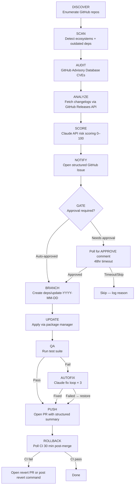

# Dep Bot — Automated Dependency Management

> An automated, AI-powered dependency management system that scans personal GitHub
> repositories on a schedule, analyzes available updates using Claude, scores them
> for risk, notifies the owner, and — upon approval — applies changes, runs QA,
> auto-fixes regressions, and opens a pull request. Built as a portfolio-grade project
> demonstrating senior-level front-end engineering, API integration, and system design.

---

## Pipeline Overview



---

## Setup & Installation

### Prerequisites

- Node.js ≥ 20.0.0
- A GitHub account with a personal access token (or use GitHub Actions GITHUB_TOKEN)
- An Anthropic API key

### Steps

1. **Clone the repository**
   ```bash
   git clone https://github.com/YOUR_USERNAME/project-dependency-workflow.git
   cd project-dependency-workflow
   ```

2. **Install dependencies**
   ```bash
   npm install
   ```

3. **Configure the bot**
   Edit `bot.config.json` and set at minimum:
   ```json
   {
     "github_username": "your-github-username"
   }
   ```

4. **Set environment variables** (for local runs)
   ```bash
   export GITHUB_TOKEN=ghp_...
   export ANTHROPIC_API_KEY=sk-ant-...
   ```

5. **Run in dry-run mode** to verify setup
   ```bash
   DRY_RUN=true node src/index.js
   ```

6. **Deploy to GitHub Actions**
   Push the repository to GitHub. The workflow at `.github/workflows/deps-bot.yml`
   will trigger automatically on Mondays at 08:00 UTC. Add the required secrets
   in your repository settings.

---

## Environment Variables

| Variable | Required | Description | Example |
|---|---|---|---|
| `GITHUB_TOKEN` | Yes | GitHub PAT or Actions token. Needs `repo`, `issues`, and `pull-requests` write. | `ghp_abc123` |
| `ANTHROPIC_API_KEY` | Yes | Anthropic API key for Claude analysis. | `sk-ant-...` |
| `DISCORD_WEBHOOK` | No | Discord webhook URL for push notifications. | `https://discord.com/api/webhooks/...` |
| `NTFY_TOPIC` | No | ntfy.sh topic name for push notifications. | `my-dep-bot-alerts` |
| `TARGET_REPO` | No | Limit run to a single repository by name or full name. | `my-repo` or `username/my-repo` |
| `DRY_RUN` | No | Set to `"true"` to run without making changes. Overrides `bot.config.json`. | `"true"` |
| `LOG_LEVEL` | No | Pino log level. Defaults to `"info"`. | `"debug"` |

---

## Configuration Reference (`bot.config.json`)

| Key | Type | Default | Description |
|---|---|---|---|
| `schedule` | string | `"0 8 * * 1"` | Cron schedule for GitHub Actions. |
| `github_username` | string | `""` | Your GitHub username. Used to scope repo discovery. |
| `excluded_repos` | string[] | `[]` | Repo names to skip entirely. |
| `priority_repos` | string[] | `[]` | Repos to process first in each run. |
| `notification_webhook` | string | `""` | Discord or ntfy.sh webhook URL (same as env var). |
| `approval_timeout_hours` | number | `48` | Hours to wait for approval before skipping a major update. |
| `minor_auto_approve_delay_hours` | number | `6` | Hours to wait before auto-approving a minor update. |
| `max_autofix_attempts` | number | `3` | Maximum Claude-powered autofix iterations per failure. |
| `auto_approve_patch` | boolean | `true` | Auto-approve patch updates with risk ≤ 30. |
| `auto_approve_minor` | boolean | `true` | Auto-approve minor updates with risk ≤ 50. |
| `auto_approve_major` | boolean | `false` | Auto-approve major updates (not recommended). |
| `risk_threshold_auto_approve` | number | `50` | Risk scores above this always require manual approval. |
| `dry_run` | boolean | `false` | Run full pipeline without applying any changes. |
| `cache_ttl_hours` | number | `24` | How long changelog analysis results are cached. |

---

## Design Decisions

### Why Claude API for analysis (vs. static semver heuristics)?

Static heuristics (e.g., "major bump = high risk") miss the most important signal:
*what actually changed*. A major version bump in a small utility may be trivial;
a patch release for a crypto library may be critical. Claude can read a changelog,
identify breaking changes, assess the blast radius in plain English, and produce
a structured JSON risk score — something no regex or semver rule can replicate.
The cost is a few cents per analysis run, and results are cached to avoid repeat calls.

### Why GitHub Advisory Database (vs. Snyk/Dependabot)?

The GitHub Advisory Database is free, open, and queryable via GraphQL without
rate-limit concerns for personal use. Snyk requires paid tiers for private repos
at scale, and Dependabot is a black box — this project intentionally builds a
transparent, inspectable alternative that shows its reasoning at every step.

### Why file-based cache (vs. Redis/DB)?

This bot runs as a transient GitHub Actions job. A Redis instance would require
always-on infrastructure, adding cost and operational overhead that exceeds the
value for a single-user tool. A JSON file checked into `.cache/` (gitignored) is
zero-infrastructure, immediately inspectable with any editor, and sufficient for
the access patterns here (keyed reads/writes, per-package granularity, 24hr TTL).

### The approval gate UX rationale

The gate is designed around the cognitive model of "interrupt only when necessary."
Patch updates are invisible — they just happen. Minor updates run overnight and
appear as a PR the next morning. Only major bumps (or anything Claude flags as
high-risk) interrupt the owner's workflow with an issue that requires a response.
This mirrors how experienced engineers mentally categorize dependency updates,
making the bot feel like a smart assistant rather than a noisy alarm system.

---

## Known Limitations

- **No private repo changelog access**: The GitHub Releases API only returns
  changelog data for public repos. Private dependency changelogs fall back to
  Claude analyzing version numbers alone, reducing analysis quality.
- **npm only at MVP**: Scanner and updater initially support Node.js/npm only.
  Python, Rust, Go, and Ruby support is added in Step 9.
- **No lock-file conflict resolution**: If a dependency update causes lock-file
  conflicts, the autofix loop may not resolve them. The bot will surface the
  failure but not guarantee a clean PR.
- **GitHub Actions rate limits**: The bot respects rate limits via exponential
  backoff, but very large repositories (hundreds of outdated deps) may approach
  GitHub's secondary rate limits during a single run.
- **Dashboard is read-only**: The dashboard displays run history and scores but
  does not provide a UI for approving updates — that still happens via GitHub
  Issue comments, which is intentional (one authoritative approval surface).
